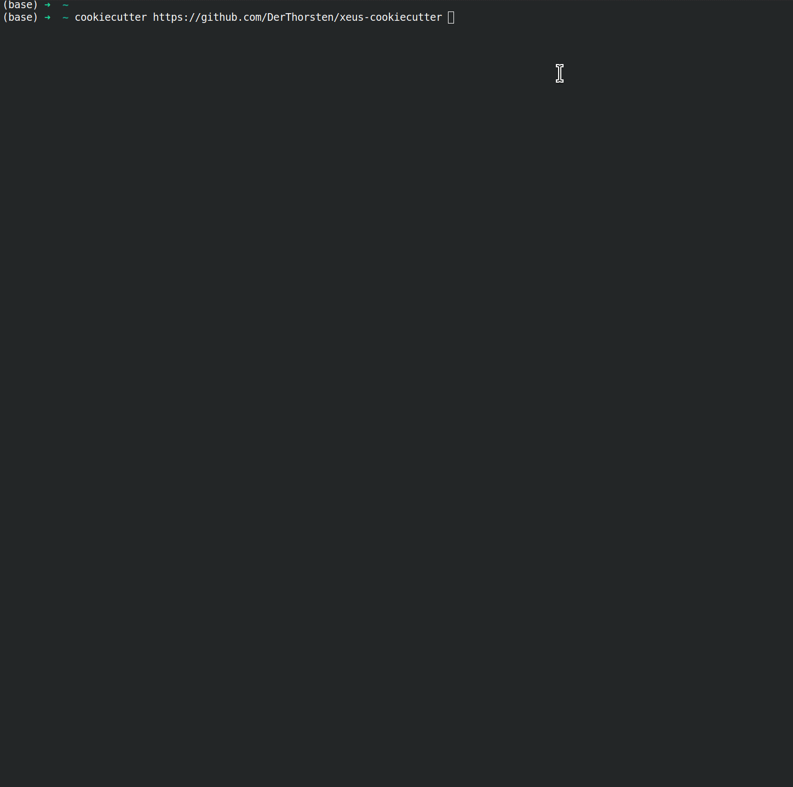

=================================================
xeus-cookiecutter
=================================================

.. image:: xeus-cookiecutter.svg
   :scale: 150 %

.. image:: https://github.com/DerThorsten/xeus-cookiecutter/actions/workflows/main.yml/badge.svg
    :target: https://github.com/DerThorsten/xeus-cookiecutter/actions/workflows/main.yml

.. image:: https://github.com/DerThorsten/xeus-cookiecutter/actions/workflows/main.yml/badge.svg?branch=rendered
    :target: https://github.com/DerThorsten/xeus-cookiecutter/actions/workflows/main.yml

.. image:: https://readthedocs.org/projects/xeus-cookiecutter/badge/?version=latest
        :target: http://xeus-cookiecutter.readthedocs.io/en/latest/?badge=latest
        :alt: Documentation Status               

Usage
-------

.. list-table:: Variables
   :header-rows: 1

   * - Variables Name
     - Default Value
     - Meaning

   * - full_name
     - John Doe
     - Name of the author. Used in copyright sections.

   * - email
     - john@doe.de
     - Email of the author.

   * - github_user_name
     - JohnDoe
     - Github user / organization name
   
   * - language
     - mylang
     - name of your language. Ie "lua", "R", "python", etc.
   
   * - language_mimetype
     - text/x-mylangrc
     - Mimetype of the programing language. Used in the `kernel.json` file.
   
   * - language_file_extension
     - mylang
     - File extension of the programing language. Used in the `kernel.json` file.
   
   * - language_version
     - 1.0.0
     - Version of the language. Used in the `kernel.json` file.
   
   * - with_wasm
     - no
     - Include code to build your kernel for wasm with emscripten. Not every kernel / language can be compiled to wasm code.
   
   * - with_debugger
     - no
     - Include code for the debugger to support the debugger protocol. This is only a placeholder for future releases. Atm this option is only used in the `kernel.json` file.
   
   * - project_name
     - xeus-mylang
     - The name of the project. This is used everywhere.
   
   * - kernel_name
     - xmylang
     - The name of the kernel itself. 
   
   * - package_name
     - xeus-mylang
     - The name of the  package.
   
   * - library_name
     - xeus-mylang
     - The name of the shared/static library.
   
   * - binary_name
     - xmylang
     - Name of ther binary.
   
   * - conda_package_name
     - xeus-mylang
     - The name of the conda package for this package. This is used in the `environment.yml` which is used for `mybinder <https://mybinder.org/>`_ support. This only becomes useful once the package is released on conda-forge (this has to be done by hand).
   
   * - cmake_package_name
     - xeus-mylang
     - Name of the cmake package
   
   * - readthedocs_package_name
     - xeus-mylang
     - Name of the package on `readthedocs <https://readthedocs.org/>`_. (The package has to be activated on readthedocs by hand).
   
   
   * - github_project_name
     - xeus-mylang
     - The name of the root folder / the name of the project on `github <https://www.github.com/>`_ 
   
   * - branch_name
     - main
     - The default branch name
   
   * - cpp_root_folder
     - xeus-mylang
     - The name of the C++ root include folder.
   
   * - config_file_name
     - xeus_mylang_config
     - Name of the `*.hpp` config file in the include folder.
   
   * - cpp_namespace
     - xeus_mylang
     - Name of the C++ namespace used for this project.
   
   * - cpp_macro_prefix
     - XEUS_MYLANG
     - Prefix for macros used in C++ for this project.
   
   * - cmake_var_prefix
     - XEUS_MYLANG
     - Prefix for CMake variables used in CMake for this project.
   
   * - cpp_standard
     - 17
     - Which C++ standard shall be used. At the moment one can choose between 14 and 17.
   
   * - open_source_license
     - BSD 3-Clause License
     - Which license shall be attached to your project.
